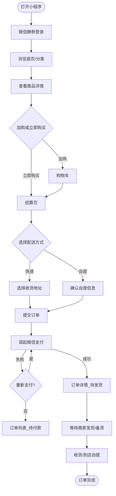
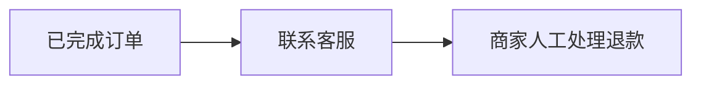
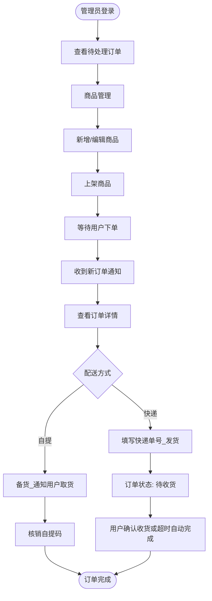
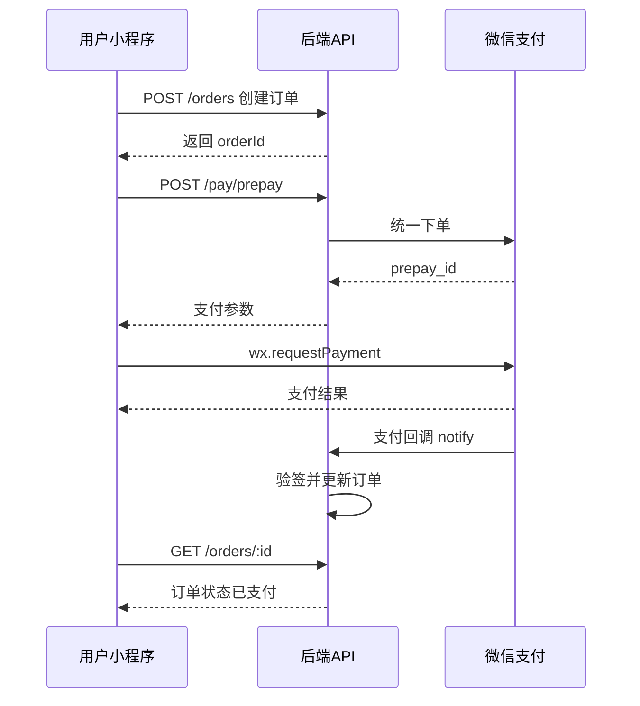

# 核心用户流程图

## C 端：浏览 → 下单 → 支付 → 履约

```mermaid
flowchart TD
  Start([打开小程序]) --> Login[微信静默登录]
  Login --> Home[浏览首页/分类]
  Home --> Detail[查看商品详情]
  Detail --> AddCart{加购或立即购买}
  AddCart -->|加购| Cart[购物车]
  AddCart -->|立即购买| Checkout[结算页]
  Cart --> Checkout
  Checkout --> SelectDelivery{选择配送方式}
  SelectDelivery -->|快递| Address[选择收货地址]
  SelectDelivery -->|自提| Pickup[确认自提信息]
  Address --> Submit[提交订单]
  Pickup --> Submit
  Submit --> Pay[调起微信支付]
  Pay -->|成功| OrderDetail[订单详情_待发货]
  Pay -->|失败| Retry{重新支付?}
  Retry -->|是| Pay
  Retry -->|否| OrderList[订单列表_待付款]
  OrderDetail --> WaitShip[等待商家发货/备货]
  WaitShip --> Receive[收货/到店自提]
  Receive --> Complete([订单完成])
```

## C 端：售后简化流程（MVP）

```mermaid
flowchart LR
  Completed[已完成订单] --> Contact[联系客服]
  Contact --> Manual[商家人工处理退款]
```

## B 端：上架 → 接单 → 履约

```mermaid
flowchart TD
  AdminLogin([管理员登录]) --> Dashboard[查看待处理订单]
  Dashboard --> ProductMgmt[商品管理]
  ProductMgmt --> CreateProduct[新增/编辑商品]
  CreateProduct --> Publish[上架商品]
  Publish --> WaitOrder[等待用户下单]
  WaitOrder --> NewOrder[收到新订单通知]
  NewOrder --> CheckOrder[查看订单详情]
  CheckOrder --> DeliveryType{配送方式}
  DeliveryType -->|快递| Ship[填写快递单号_发货]
  DeliveryType -->|自提| Prepare[备货_通知用户取货]
  Ship --> Shipped[订单状态: 待收货]
  Prepare --> Verify[核销自提码]
  Verify --> Done([订单完成])
  Shipped --> AutoComplete[用户确认收货或超时自动完成]
  AutoComplete --> Done
```

## 支付时序

```mermaid
sequenceDiagram
  participant User as 用户小程序
  participant API as 后端API
  participant WX as 微信支付

  User->>API: POST /orders 创建订单
  API-->>User: 返回 orderId
  User->>API: POST /pay/prepay
  API->>WX: 统一下单
  WX-->>API: prepay_id
  API-->>User: 支付参数
  User->>WX: wx.requestPayment
  WX-->>User: 支付结果
  WX->>API: 支付回调 notify
  API->>API: 验签并更新订单
  User->>API: GET /orders/:id
  API-->>User: 订单状态已支付
```
