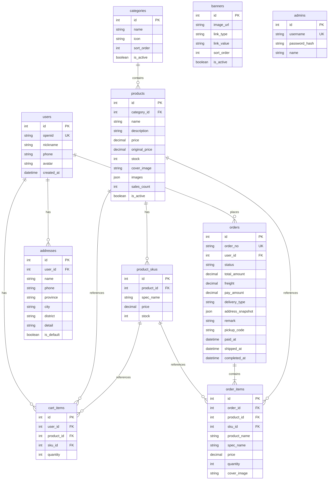

# 数据库设计

## ER 关系图

## 订单状态枚举

| 值 | 说明 |
|----|------|
| `pending` | 待付款 |
| `paid` | 已付款/待发货 |
| `shipped` | 已发货/待收货 |
| `completed` | 已完成 |
| `cancelled` | 已取消 |
| `refunding` | 退款中（P2） |

## 配送方式

| 值 | 说明 |
|----|------|
| `pickup` | 到店自提 |
| `express` | 快递配送 |

## 索引建议

- `users.openid` UNIQUE
- `orders.order_no` UNIQUE
- `orders(user_id, status)`
- `products(category_id, is_active)`
- `cart_items(user_id, product_id, sku_id)` UNIQUE
